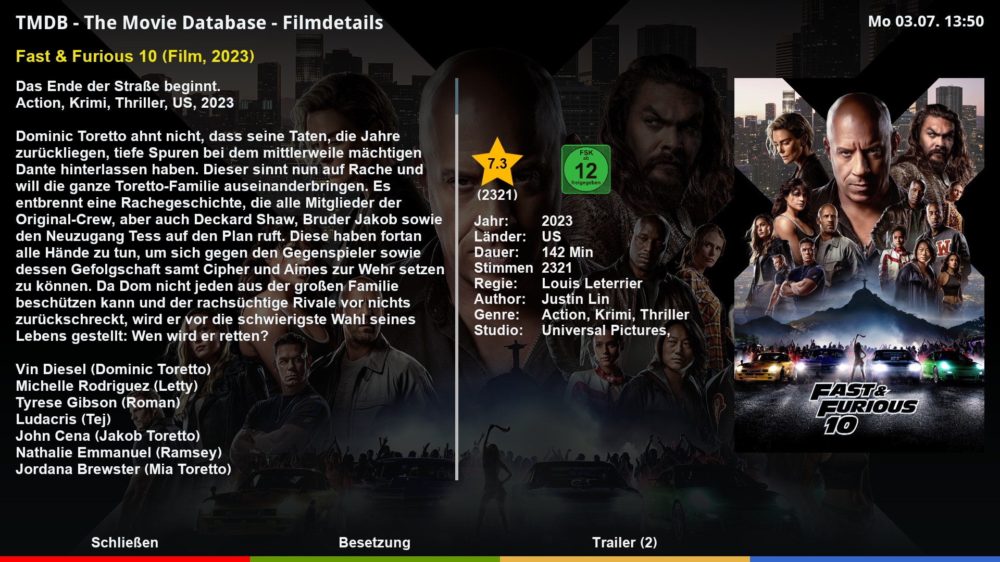

# The Movie Database plugin TMDBCockpit

## Features
- Shows detailed movie/tv show information provided by TMDB.
- Can be invoked thru movie lists (standard, EMC, etc.) or thru yellow or blue key in the EPG lists.
- Provides an interface for other plugins to access TMDB data without opening TMDBCockpit screens.
- Allows to save movie as well as series episode covers, descriptions and backdrops.
- Allows unique tmdb api key in /etc/enigma2/tmdb_key.txt
- Allows playback of trailer with either MediaPortal or MyTube
- Supports HD, FHD, and WQHD skin resolutions.

## Installation
To install the TMDBCockpit plugin execute the following command in a console on your dreambox:
- apt-get install wget (required the first time only)
- wget https://dream-alpha.github.io/TMDBCockpit/tmdbcockpit.sh -O - | /bin/sh

The installation script will also install a feed source that enables a convenient upgrade to the latest version with the following commands or automatically as part of a DreamOS upgrade:
- apt-get update
- apt-get upgrade

## Languages
- english
- german
- arabic  (by ostende)
- italian (by Spaeleus)
- russian (by ay4488)
- turkish (by audi06_19)
- spanish (by Magog)
- dutch   (by msatter)

## Links
- Support: https://github.com/dream-alpha/TMDBCockpit/discussions
- Package feed: https://gemfury.com/dream-alpha
